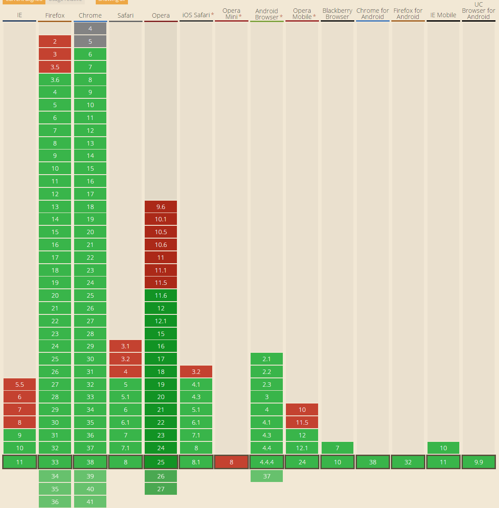

<meta http-equiv="content-type" content="text/html; charset=UTF-8">

<link href="css/markdown.css" rel="stylesheet" />

<link href="css/prettify.css" rel="stylesheet" />

<script src="http://apps.bdimg.com/libs/jquery/2.0.3/jquery.min.js"></script>

<script src="js/prettify.js"></script>  

移动端弹性布局
============

>移动端手机屏幕大小不一，如何自动根据屏幕大小进行适配，是个难题。  
经过对比几个流行的前端适配框架，如 weui（微信）、bootstrape（大名鼎鼎）、sui（淘宝），
发现淘宝的 sui mobile 样式框架小巧适用。    
本文通过对 sui 进行分拆解析说明，让刚接触前端的同学能理解并快速上手使用移动端布局。

>同时对流行的 flex 弹性布局进行了兼容性说明。flex弹性布局非常简单、适用，特别适合移动端，但是存在兼容性问题。

## flex 兼容性

- gulp less 编译器对兼容性做了自动化处理，你只需在less中写最新的flex语法，less编译成css时，会自动增加兼容性处理！！！  
- sui中的flex.less 使用函数对兼容性做了处理，如果 gulp less没有搞定兼容性，可自行调整 flex.less 进行处理。  

## 为什么要学弹性布局

- 微信的weui 在用
- 淘宝的 sui 在用
- bootstrape 4 在用  
- react native 只能使用 flex布局！掌握了 flex，也就等于掌握了 安卓、苹果手机APP的前端布局！
- 在手机上、一些局部排版，的确非常简单有效

## 相关资源

- H5移动端知识点总结 http://www.cnblogs.com/tugenhua0707/p/5180841.html
  http://www.open-open.com/lib/view/open1454548816823.html
- Flex 语法 http://www.ruanyifeng.com/blog/2015/07/flex-grammar.html?utm_source=tuicool
- Flex 实例 http://www.ruanyifeng.com/blog/2015/07/flex-examples.html
- 布局：http://isux.tencent.com/web-app-rem.html  
- 关于webapp中的文字单位的一些捣腾：http://www.html-js.com/article/2400
- 手机淘宝的flexible设计与实现：ßhttp://www.html-js.com/article/2402
- Web移动端Fixed布局的解决方案：http://www.tuicool.com/articles/Inyueyi

## rem 长度单位

>rem是CSS3新增的一个相对单位（root em，根em），这个单位引起了广泛关注。这个单位与em有什么区别呢？区别在于使用rem为元素设定字体大小时，仍然是相对大小，但相对的只是HTML根元素，而不是em那样相对不确定的上级元素。  
这个单位可谓集相对大小和绝对大小的优点于一身，通过它既可以做到只修改根元素就成比例地调整所有字体大小，又可以避免字体大小逐层复合的连锁反应。目前，除了IE8及更早版本外，所有浏览器均已支持rem。移动端建议使用rem！

>如果认为rem只是字体大小，就太小看它了，实际上，rem可用于任何元素的空间单位，在转换时，通过 html的font-size转换为px！

### px

我们一般喜欢用px像素（Pixel），px是像素的意思，相对于屏幕的分辨率而言，是个绝对单位。  
px的缺点非常明显，就是无法根据屏幕大小缩放，无法自动适配不同屏幕。

### em

em是相对上层元素的长度单位。em的值并不是固定的，父级元素的字体变化，会引起其变化，容易引起连锁反应，导致显示的不确定，因此不太适合大型项目。    
如上层字体未定义，则相对于浏览器的默认字体尺寸，浏览器的默认字体高都是16px。所有未经调整的浏览器都符合: 1em=16px。

### rem
rem 是相对于 html 元素的 font-size 的一个单位。如果 html 上定义了 font-size: 20px;则无论在任何地方都是 1rem = 20px 这个大小不会受到父元素的影响。

rem综合评价是用来做web app它绝对是最合适的人选之一。  
我们统一使用rem对页面进行整体缩放。强烈建议大家对需要适应页面大小的任何元素都使用 rem 为单位来定义。  
小于 375px 的设备上不做缩小处理，对 大于 375px 宽度的设备进行等比缩放。


## 移动适配布局分析

>web app的屏幕适配有很多中做法，例如：流式布局、限死宽度，还有就是通过响应式来做，但是这些方案都不是最佳的解决方法。  

### 流式布局

例如流式布局的解决方案有不少弊端，它虽然可以让各种屏幕都适配，但是显示的效果极其的不好，因为只有几个尺寸的手机能够完美的显示出视觉设计师和交互最想要的效果，但是目前行业里用流式布局切web app的公司还是挺多的，看看下面我收集的一些案例：  

1. 亚马逊
2. 携程
3. 兰亭

上面的网站都是采用的流式布局的技术实现的，他们在页面布局的时候都是通过百分比来定义宽度，但是高度大都是用px来固定住，所以在大屏幕的手机下显示效果会变成有些页面元素宽度被拉的很长，但是高度还是和原来一样，实际显示非常的不协调，这就是流式布局的最致命的缺点，往往只有几个尺寸的手机下看到的效果是令人满意的，其实很多视觉设计师应该无法接受这种效果，因为他们的设计图在大屏幕手机下看到的效果相当于是被横向拉长来一样。

流式布局并不是最理想的实现方式，通过大量的百分比布局，会经常出现许多兼容性的问题，还有就是对设计有很多的限制，因为他们在设计之初就需要考虑流式布局对元素造成的影响，只能设计横向拉伸的元素布局，设计的时候存在很多局限性。


### 固定宽度做法

还有一种是固定页面宽度的做法，早期有些网站把页面设置成320的宽度，超出部分留白，这样做视觉，前端都挺开心，视觉在也不用被流式布局限制自己的设计灵感了，前端也不用在搞坑爹的流式布局。但是这种解决方案也是存在一些问题，例如在大屏幕手机下两边是留白的，还有一个就是大屏幕手机下看起来页面会特别小，操作的按钮也很小，手机淘宝首页起初是这么做的，但近期改版了，采用了rem。

### 响应式做法

响应式这种方式在国内很少有大型企业的复杂性的网站在移动端用这种方法去做，主要原因是工作大，维护性难，所以一般都是中小型的门户或者博客类站点会采用响应式的方法从web page到web app直接一步到位，因为这样反而可以节约成本，不用再专门为自己的网站做一个web app的版本。 

相应式一般都会使用 BootStrape 库，来实现网站与手机自动适配，jQuery + bootstrape.js + bootstrape.css = 250k，对于一些简单的页面，需要加载 250k第三方库，似乎有些小题大做。 

针对手机专用的页面，根本不需要考虑pc，因此，个人不太建议手机web采用 bootstrape库！

### 设置viewport进行缩放

天猫的web app的首页就是采用这种方式去做的，以320宽度为基准，进行缩放，最大缩放为320*1.3 = 416，基本缩放到416都就可以兼容iphone6 plus的屏幕了，这个方法简单粗暴，又高效。说实话我觉得他和用接下去我们要讲的rem都非常高效，不过有部分同学使用过程中反应缩放会导致有些页面元素会糊的情况。

### rem 等比例适配所有屏幕

由于 rem 是通过根元素进行适配的，网页中的根元素指的是html，我们通过设置html的字体大小就可以控制rem的大小。  
举个按钮的例子：

```css
html{
  font-size:10px;
}
.btn {
  width: 6rem;
  height: 3rem;
  line-height: 3rem;
  font-size: 1.2rem;
  display: inline-block;
  background: #06c;
  color: #fff;
  border-radius: .5rem;
  text-decoration: none;
  text-align: center;    
}
```

在font-size:10px时，6rem=60px，如此类推，font-size:20px时，6rem=120px。

通过html font-size的改变就会导致按钮的大小发生改变，并不需要改变给按钮的宽度和高度，这就是我们想要的适配性。

### font-size 设置

到这里肯定有很多人会问我是怎么计算出不同分辨率下font-size的值？
首先假设我上面的页面设计稿给我时候是按照640的标准尺寸给我的前提下，（当然这个尺寸肯定不一定是640，可以是320，或者480，又或是375）来看一组表格。


上面的表格蓝色一列是640px的尺寸，页面是以640px的宽度去切的，怎么计算不同宽度下font-size的值，大家看表格上面的数值变化应该能明白。举个例子：384/640 = 0.6，384是640的0.6倍，所以384页面宽度下的font-size也等于它的0.6倍，这时384的font-size就等于12px。在不同设备的宽度计算方式以此类推。

可以通过JS去动态计算根元素的font-size，这样的好处是所有设备分辨率都能兼容适配，淘宝首页目前就是用的JS计算。但其实不用JS我们也可以做适配，一般我们在做web app都会先统计自己网站有哪些主流的屏幕设备，然后去针对那些设备去做media query设置也可以实现适配，例如下面这样：

```css
//375屏幕为 20px，以此为基础计算出每一种宽度的字体大小
//375以下不变，375以上等比放大

@baseWidth: 375px; // iphone6 的尺寸
@baseFont: 20px;

html {
  font-size: @baseFont;  //默认当做320px宽度的屏幕来处理
}

@bps: 400px, 414px, 480px;

.loop(@i: 1) when (@i <= length(@bps)) {  //注意less数组是从1开始的
  @bp: extract(@bps, @i);

  @font: round(@bp/@baseWidth*@baseFont,2);
  @media only screen and (min-width: @bp){
    html {
      font-size: @font !important;
    }
  }
  .loop((@i + 1));
};
.loop;
```
less 生成css如下：

```css
html {
  font-size: 20px;
}
@media only screen and (min-width: 400px) {
  html {
    font-size: 21.33px !important;
  }
}
@media only screen and (min-width: 414px) {
  html {
    font-size: 22.08px !important;
  }
}
@media only screen and (min-width: 480px) {
  html {
    font-size: 25.6px !important;
  }
}
```
    
上面的设置当然是不能所有设备全适配，但是用JS是可以实现全适配。

下面推荐两个国内用了rem技术的移动站，大家可以上去参考看看他们的做法，手机淘宝目前只有首页用了rem，淘宝native app的首页是内嵌的web app首页。

- 淘宝首页：m.taobao.com
- D X：m.dx.com

最后我们再来看一看他的兼容性：


### 通过 js 动态修改 font-size的例子

>js毕竟要执行，需要时间，建议使用 css 解决。

```js
<!DOCTYPE html>
<html lang="zh-cmn-Hans">
<head>
    <meta charset="UTF-8">
    <title>rem phone test</title>
    <meta name="viewport" content="user-scalable=no, initial-scale=1.0, maximum-scale=1.0, minimum-scale=1.0">
    <style>
        html {
            height: 100%;
            width: 100%;
            font-family: 'Heiti SC', 'Microsoft YaHei';
            font-size: 20px;
            overflow: hidden;
            outline: 0;
            -webkit-text-size-adjust:none;
        }
        body {
            height: 100%;
            margin: 0;
            overflow: hidden;
            -webkit-user-select: none;
            position: relative;
        }
        header,
        footer {
            width: 100%;
            line-height: 1.5rem;
            font-size: 1rem;
            color: #000;
            border: 1px solid #ccc;
            text-align: center;
            background-color: #ccc;
        }
        .bd {
            margin-top: 1rem;
            margin-bottom: .5rem;
            margin-right: -.5rem;
            font-size: 0;
        }
        .box {
            width: 5rem;
            height: 5rem;
            display: inline-block;
            margin-right:.5rem;
            margin-bottom: .5rem;
        }
        .blue-box {
            background-color: #06c;
        }
        .org-box {
            background-color: #1fc195;
        }
    </style>   
</head>
<body>
    <header>我是头部</header>
    <div class="bd">
        <div class="box blue-box"></div>
        <div class="box org-box"></div>
        <div class="box blue-box"></div>
        <div class="box org-box"></div>
        <div class="box blue-box"></div>
        <div class="box org-box"></div>
    </div>
    <footer>我是页脚</footer>
    <script>
        (function (doc, win) {
          var docEl = doc.documentElement,
            resizeEvt = 'orientationchange' in window ? 'orientationchange' : 'resize',
            recalc = function () {
              var clientWidth = docEl.clientWidth;
              if (!clientWidth) return;
              docEl.style.fontSize = 20 * (clientWidth / 320) + 'px';
            };

          if (!doc.addEventListener) return;
          win.addEventListener(resizeEvt, recalc, false);
          doc.addEventListener('DOMContentLoaded', recalc, false);
        })(document, window);
    </script>
</body>
</html>
```

## flex 弹性布局

```css
// 开启弹性布局
.flexbox() {
    display: -webkit-box;
    display: -ms-flexbox;
    display: -webkit-flex;
    display: flex;
}


.flex-wrap(@fw) when (@fw = nowrap) {
    -webkit-box-lines: single;
    -moz-box-lines: single;
    -webkit-flex-wrap: nowrap;
    -ms-flex-wrap: none;
    -ms-flex-wrap: nowrap;
    flex-wrap: nowrap;
}
.flex-wrap(@fw) when (@fw = wrap) {
    -webkit-box-lines: multiple;
    -moz-box-lines: multiple;
    -webkit-flex-wrap: wrap;
    -ms-flex-wrap: wrap;
    flex-wrap: wrap;
}
.flex-wrap(@fw) when not (@fw = wrap) and not (@fw = nowrap) {
    -webkit-flex-wrap: @fw;
    -ms-flex-wrap: @fw;
    flex-wrap: @fw;
}
.flex-shrink(@fs) {
    -webkit-flex-shrink: @fs;
    -ms-flex: 0 @fs auto;
    flex-shrink: @fs;
}
.justify-content(@jc) when (@jc = flex-start) {
    -webkit-box-pack: start;
    -ms-flex-pack: start;
    -webkit-justify-content: flex-start;
    justify-content: flex-start;
}
.justify-content(@jc) when (@jc = flex-end) {
    -webkit-box-pack: end;
    -ms-flex-pack: end;
    -webkit-justify-content: flex-end;
    justify-content: flex-end;
}
.justify-content(@jc) when (@jc = space-between) {
    -webkit-box-pack: justify;
    -ms-flex-pack: justify;
    -webkit-justify-content: space-between;
    justify-content: space-between;
}
.justify-content(@jc) when not (@jc = flex-start) and not (@jc = flex-end) and not (@jc = space-between) {
    -webkit-box-pack: @jc;
    -ms-flex-pack: @jc;
    -webkit-justify-content: @jc;
    justify-content: @jc;
}
.align-items(@ai) when (@ai = flex-start) {
    -webkit-box-align: start;
    -ms-flex-align: start;
    -webkit-align-items: flex-start;
    align-items: flex-start;
}
.align-items(@ai) when (@ai = flex-end) {
    -webkit-box-align: end;
    -ms-flex-align: end;
    -webkit-align-items: flex-end;
    align-items: flex-end;
}
.align-items(@ai) when not (@ai = flex-start) and not (@ai = flex-end) {
    -webkit-box-align: @ai;
    -ms-flex-align: @ai;
    -webkit-align-items: @ai;
    align-items: @ai;
}
.align-content(@ai) {
    -ms-flex-line-pack: @ai;
    -webkit-align-content: @ai;
    align-content: @ai;
}
.align-self(@as) {
    -ms-flex-item-align: @as;
    -webkit-align-self: @as;
    align-self: @as;
}
```
